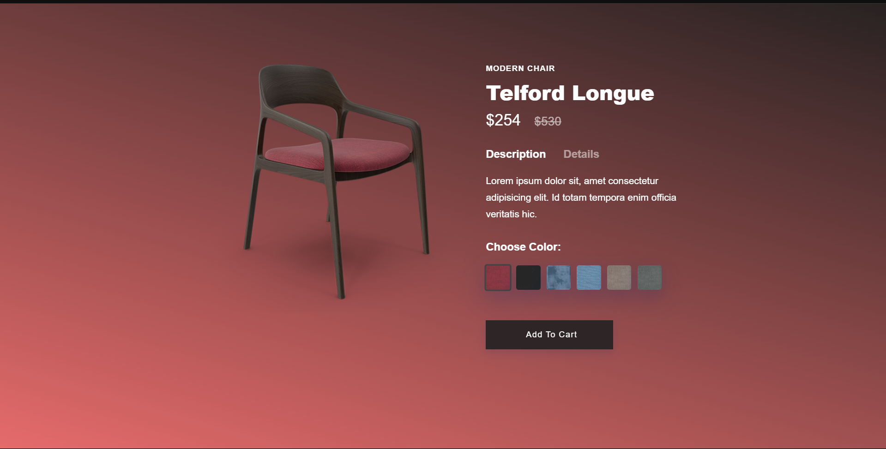

# Modern Chair Page

This project showcases a **Modern Chair** design with elegant animations. It’s built using **HTML**, **CSS**, and custom animations to provide an interactive and visually appealing user experience.

## Demo

You can view the live demo of this project here:

[Live Demo](https://modern-chair-page-two.vercel.app/)

(Replace the link with your actual demo link if available)

## Features

- Stylish and minimalistic modern chair design.
- Smooth animations on changing the color of Chair.
- Fully responsive layout for desktop and mobile.
- Easy to customize and modify.

## Technologies Used

- **HTML**: Structure of the webpage.
- **CSS**: Styling the page, animations, and layout.
- **Animations**: Custom CSS animations for an engaging user experience.

## Screenshots

